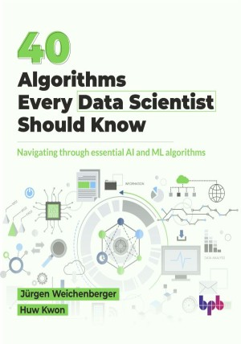

# 40 Algorithms Every Data Scientist Should Know

Navigating through essential AI and ML algorithms.

This is the repository for [40 Algorithms Every Data Scientist Should Know
](https://bpbonline.com/products/40-algorithms-every-data-scientist-should-know?variant=44086975037640),published by BPB Publications.

## About the Book
Mastering AI and ML algorithms is essential for data scientists. This book covers a wide range of techniques, from supervised and unsupervised learning to deep learning and reinforcement learning. This book is a compass to the most important algorithms that every data scientist should have at their disposal when building a new AI/ML application.

This book offers a thorough introduction to AI and ML, covering key concepts, data structures, and various algorithms like linear regression, decision trees, and neural networks. It explores learning techniques like supervised, unsupervised, and semi-supervised learning and applies them to real-world scenarios such as natural language processing and computer vision. With clear explanations, code examples, and detailed descriptions of 40 algorithms, including their mathematical foundations and practical applications, this resource is ideal for both beginners and experienced professionals looking to deepen their understanding of AI and ML.

The final part of the book gives an outlook for more state-of-the-art algorithms that will have the potential to change the world of AI and ML fundamentals.

## What You Will Learn
• Differences between supervised, unsupervised, and reinforcement learning.

• Gain expertise in data cleaning, feature engineering, and handling different data formats.

• Learn to implement and apply algorithms such as linear regression, decision trees, neural networks, and support vector machines.

• Creating intelligent systems and solving real-world problems.

• Learn to approach AI and ML challenges with a structured and analytical mindset.
